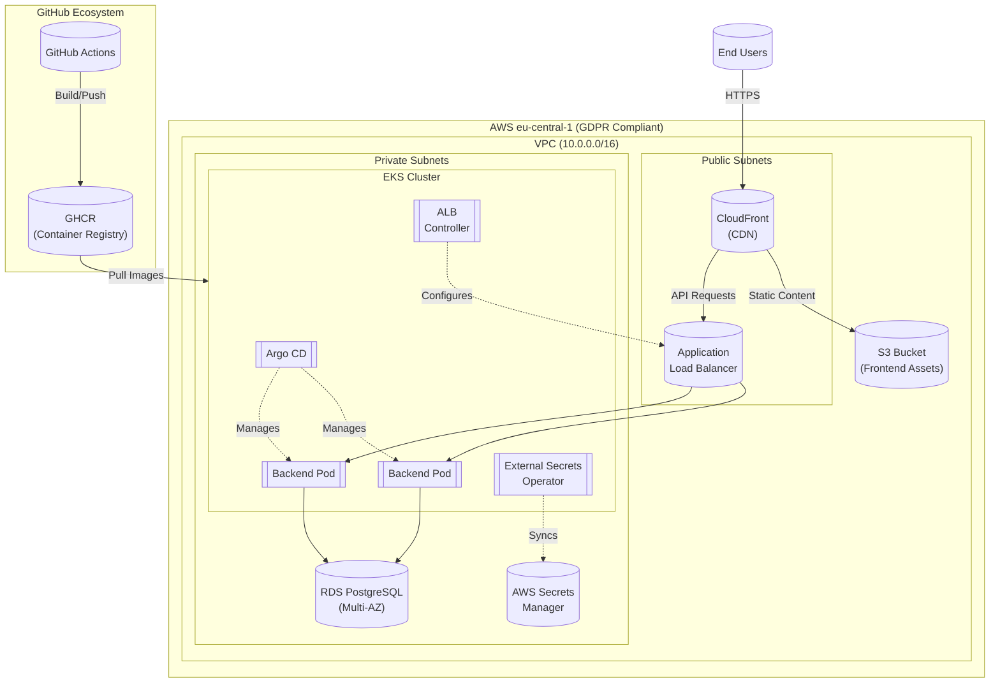

# Infrastructure Setup Guide for FastAPI Project

## Table of Contents
1. [Architecture Overview](#architecture-overview)
2. [Prerequisites](#prerequisites)
3. [Infrastructure Components](#infrastructure-components)
4. [Step-by-Step Setup](#step-by-step-setup)
5. [Security and Secrets Management](#security-and-secrets-management)
6. [Monitoring Setup](#monitoring-setup)
7. [Maintenance Procedures](#maintenance-procedures)
8. [Troubleshooting Guide](#troubleshooting-guide)

## Architecture Overview



## Prerequisites

- AWS Account with admin permissions
- Terraform v1.5+ installed
- kubectl configured
- GitHub repository with Argo CD configured
- GitHub PAT with `read:packages` scope
- Domain name for production environment

## Infrastructure Components

### Per Environment

| Environment | Cluster Name            | Namespace(s)             | VPC CIDR      |
|-------------|-------------------------|-------------------------|---------------|
| Dev         | `fastapi-eks-dev`      | `fastapi-helm-dev`      | 10.0.0.0/16  |
| Staging     | `fastapi-eks-staging`  | `fastapi-helm-staging`  | 10.1.0.0/16  |
| Production  | `fastapi-eks-prod`     | `fastapi-helm-prod`     | 10.2.0.0/16  |

## Step-by-Step Setup

### 1. VPC and EKS Setup

```hcl
# terraform/main.tf
module "vpc" {
  source = "terraform-aws-modules/vpc/aws"
  
  name = "fastapi-${var.environment}"
  cidr = var.vpc_cidr
  
  azs             = ["${var.region}a", "${var.region}b"]
  private_subnets = ["10.0.1.0/24", "10.0.2.0/24"]
  public_subnets  = ["10.0.101.0/24", "10.0.102.0/24"]
  
  enable_nat_gateway = true
  single_nat_gateway = var.environment != "production"
}

module "eks" {
  source = "terraform-aws-modules/eks/aws"
  
  cluster_name    = "fastapi-${var.environment}"
  cluster_version = "1.28"
  
  vpc_id     = module.vpc.vpc_id
  subnet_ids = module.vpc.private_subnets
  
  enable_irsa = true
}
```

### 2. External Secrets Setup

```bash
# Install External Secrets Operator
helm repo add external-secrets https://charts.external-secrets.io
helm install external-secrets external-secrets/external-secrets -n external-secrets --create-namespace

# Create SecretStore for AWS Secrets Manager
cat <<EOF | kubectl apply -f -
apiVersion: external-secrets.io/v1beta1
kind: ClusterSecretStore
metadata:
  name: aws-secrets
spec:
  provider:
    aws:
      service: SecretsManager
      region: eu-central-1
      auth:
        jwt:
          serviceAccountRef:
            name: external-secrets-sa
            namespace: external-secrets
EOF
```

### 3. AWS Secrets Structure

```
production/
  postgres/credentials
  app/secrets
staging/
  postgres/credentials
  app/secrets
dev/
  postgres/credentials
  app/secrets
```

### 4. Argo CD Installation

```bash
kubectl create namespace argocd
kubectl apply -n argocd -f https://raw.githubusercontent.com/argoproj/argo-cd/stable/manifests/install.yaml

# Get initial admin password
kubectl -n argocd get secret argocd-initial-admin-secret -o jsonpath="{.data.password}" | base64 -d
```

### 5. GHCR Access Setup

```bash
kubectl create secret docker-registry ghcr-secret \
  --namespace=fastapi-${ENV} \
  --docker-server=ghcr.io \
  --docker-username=your-github-username \
  --docker-password=ghp_yourPATtoken
```

## Security and Secrets Management

### IAM Policies

```hcl
# External Secrets Operator policy
data "aws_iam_policy_document" "external_secrets" {
  statement {
    actions = [
      "secretsmanager:GetSecretValue",
      "secretsmanager:DescribeSecret"
    ]
    resources = [
      "arn:aws:secretsmanager:${var.region}:${data.aws_caller_identity.current.account_id}:secret:${var.environment}/*"
    ]
  }
}

# GitHub Actions policy for frontend deployment
data "aws_iam_policy_document" "github_actions" {
  statement {
    actions = [
      "s3:PutObject",
      "s3:GetObject",
      "s3:ListBucket",
      "s3:DeleteObject"
    ]
    resources = [
      aws_s3_bucket.frontend.arn,
      "${aws_s3_bucket.frontend.arn}/*"
    ]
  }

  statement {
    actions = ["cloudfront:CreateInvalidation"]
    resources = [aws_cloudfront_distribution.frontend.arn]
  }
}
```

## Monitoring Setup

### CloudWatch Alarms

```hcl
resource "aws_cloudwatch_metric_alarm" "high_5xx_errors" {
  alarm_name          = "High5xxErrors-${var.environment}"
  comparison_operator = "GreaterThanThreshold"
  evaluation_periods  = "2"
  metric_name         = "5xxErrorRate"
  namespace           = "AWS/ApplicationELB"
  period              = "300"
  statistic           = "Sum"
  threshold           = "10"
  alarm_description   = "High 5xx errors from ALB"
  alarm_actions       = [aws_sns_topic.alerts.arn]
}
```

## Maintenance Procedures

### Database Backups

```hcl
resource "aws_db_instance" "postgres" {
  identifier = "fastapi-${var.environment}"
  backup_retention_period = 7
  backup_window           = "03:00-04:00"
  maintenance_window      = "Sun:04:00-Sun:05:00"
  
  # Multi-AZ only for production
  multi_az = var.environment == "production"
}
```

### Secret Rotation Schedule

- Database credentials: Every 90 days
- Application secrets: Every 180 days
- Access tokens: Every 30 days

## Troubleshooting Guide

| Issue | Solution |
|-------|----------|
| Image pull errors | Verify GHCR secret exists and is valid in namespace |
| 502 Bad Gateway | Check EKS pod logs and ALB target group health |
| Slow frontend loading | Invalidate CloudFront cache |
| Secret sync failures | Check External Secrets Operator logs and IAM permissions |
| Database connection issues | Verify security group rules and credential secrets |

---

For detailed deployment instructions, see [Deployment Automation Guide](./deployment-automation.md).

For release procedures, see [Release Strategy Guide](./release-strategy.md).